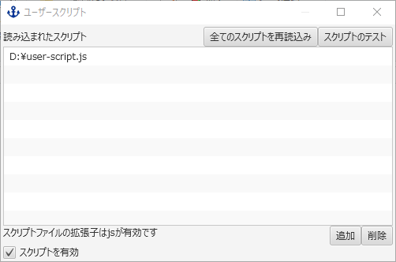

# 航海日誌 ユーザースクリプトプラグイン
航海日誌 ユーザースクリプトプラグインは航海日誌(logbook-kai)にユーザースクリプト機能を追加するプラグインです。



## ユーザースクリプトとは
サーバーから送られてくるデータに対して任意の処理を行うことが出来ます。通信内容を変更することは出来ません。

## 使い方
 * 航海日誌のpluginsフォルダに[ダウンロード](https://github.com/sanaehirotaka/logbook-script-loader/releases)したscript-loader.jarを置いて航海日誌を再起動してください
 * 再起動後、[その他]メニューから[ユーザースクリプト]を選択することで利用出来ます。

## 仕様
 - スクリプト言語としてJavaScriptが標準でサポートされています。[Nashornユーザーズ・ガイド](https://docs.oracle.com/javase/jp/8/docs/technotes/guides/scripting/nashorn/toc.html)
 - スクリプトには引数を持たない``run``メソッドが定義されている必要があります。
 - ``run``メソッドはAPIがキャプチャされた時に呼び出されます。
 - ``run``メソッド実行時に次のグローバル変数が定義されます。
   - ``uri`` 要求URI(``String``)
   - ``req`` 要求パラメーター(``Map<String,List<String>>``)
   - ``res`` 応答JSON(``JsonObject``)

## サンプル
最も単純なスクリプト例 (``print``は標準出力に出力されます)
```js
function run() {
    print("Hello world.");
}
```
少し複雑なスクリプト例。このサンプルは母港に戻った時に提督経験値の差分を標準出力に表示します。
```js
var ZonedDateTime = java.time.ZonedDateTime;
var DateTimeFormatter = java.time.format.DateTimeFormatter;

var format = DateTimeFormatter.ofPattern("yyyy-MM-dd HH:mm:ss");
var gexp;
function run() {
    if (uri == "/kcsapi/api_port/port") {
        var exp = res.api_data.api_basic.api_experience;
        if (gexp) {
            var compare = exp - gexp;
            print(format.format(ZonedDateTime.now()) + " : " + exp + "(+" + compare + ")");
        }
        gexp = exp;
    }
}
```
